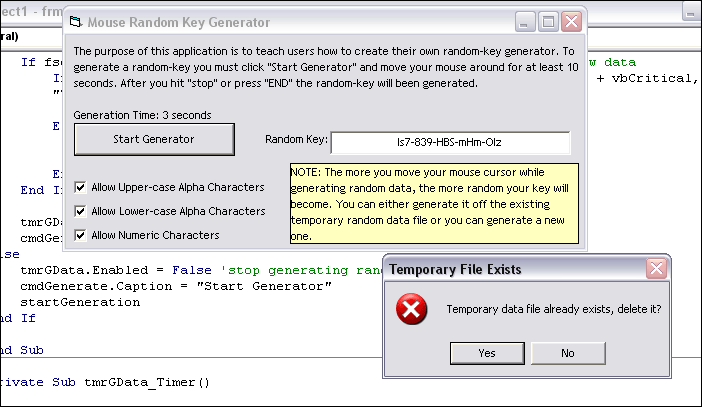



## Mouse KeyGen

### Description

UPDATE: Changed save path and included hotkeys to start/stop generator so that random data can be produced without the fact that the mouse was around the command button. Somebody gave me a comment about creating a key generator based on

mouse movement and I had already heard about this previously and decided to

make my own version of it. Well here you have it. You can modify this key-gen

to be more random if you'd like, it is just a simple example. You can choose options between the generator to generate uppercase/lowercase alpha and numeric characters. I'm too lazy to

make more settings modifiable such as interval for recording, choosing save

location, whatever else.. But anyhow, please VOTE FOR ME!

Extra Notes: AT PSC search for "DNS Browser" for a 100+ source code web browser

I spent over 2 1/2 months working on it so go check it out and give me feedback
 
### More Info
 

             |
---                |---
**Submitted On**   |2004-12-31 06:31:16
**By**             |[Daniel M](https://github.com/Planet-Source-Code/PSCIndex/blob/master/ByAuthor/daniel-m.md)
**Level**          |Advanced
**User Rating**    |4.0 (16 globes from 4 users)
**Compatibility**  |VB 6\.0
**Category**       |[Coding Standards](https://github.com/Planet-Source-Code/PSCIndex/blob/master/ByCategory/coding-standards__1-43.md)
**World**          |[Visual Basic](https://github.com/Planet-Source-Code/PSCIndex/blob/master/ByWorld/visual-basic.md)
**Archive File**   |[Mouse\_KeyG18348112312004\.zip](https://github.com/Planet-Source-Code/daniel-m-mouse-keygen__1-57977/archive/master.zip)

### API Declarations

Included in project.

